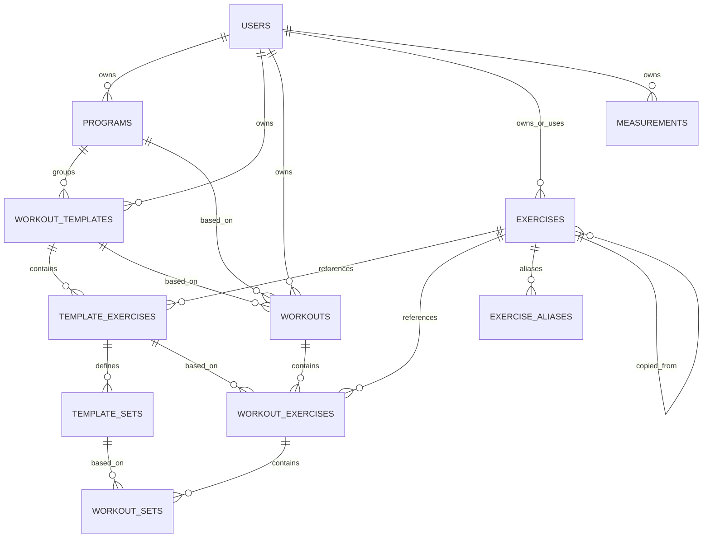
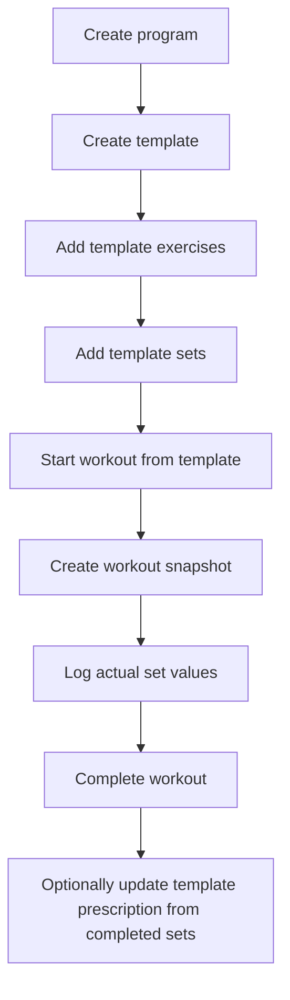
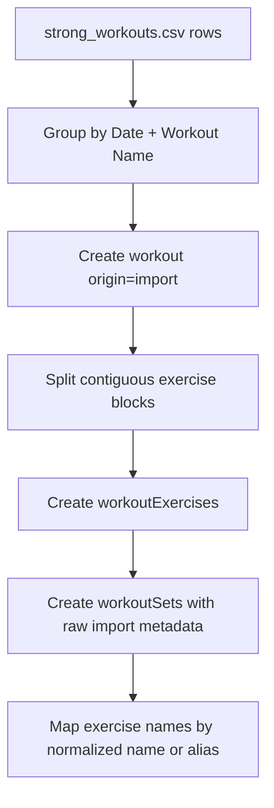

# Data model

This document describes the new structured backend model for Fitts.

Scope:

- workout programs
- workout templates
- performed workouts
- exercises and exercise aliases
- body/health measurements
- Strong import compatibility

Out of scope for v1:

- AI coaching logic
- template version history
- calorie tracking
- frontend migration details

## Design principles

1. **Workout != template**
   - `workout` is a performed session.
   - `workoutTemplate` is a reusable routine.

2. **Programs group templates**
   - a program is a named container for templates
   - templates can also exist outside a program

3. **Template start creates a snapshot**
   - starting a workout from a template creates a new `workout`
   - exercises and sets are copied into workout-owned rows immediately
   - the workout becomes the historical source of truth

4. **History lives in workouts, not template versions**
   - templates keep only the current prescription
   - actual performed values live on workout sets
   - “last time” lookups come from completed workout history

5. **Import fidelity matters**
   - Strong imports keep raw/import metadata
   - imported workouts do not require template linkage

6. **Units are presentation-level**
   - values are stored in canonical units plus original entered/imported units
   - users can switch display units later without rewriting historical data

## Canonical units

- weight: grams
- distance: meters
- body measurements: millimeters
- duration: seconds
- body fat percentage: numeric percentage value

## Entity graph

## Table overview

### `programs`

Container for workout templates.

Fields:

- `userId`
- `name`
- `normalizedName`
- `description?`
- `notes?`
- `copiedFromProgramId?`
- `archivedAt?`

Notes:

- templates may belong to zero or one program
- sharing is snapshot-copy based, so provenance is stored with `copiedFromProgramId`

### `workoutTemplates`

Reusable workout routine.

Fields:

- `userId`
- `programId?`
- `name`
- `normalizedName`
- `description?`
- `notes?`
- `copiedFromTemplateId?`
- `archivedAt?`

Notes:

- no template versioning in v1
- template stores only the current prescription
- template may be updated later using completed workout data

### `templateExercises`

Ordered exercise rows inside a template.

Fields:

- `templateId`
- `order`
- `exerciseId`
- `exerciseNameSnapshot`
- `notes?`

Why snapshot names?

- historical readability
- later exercise renames do not destroy the template’s visible structure

### `templateSets`

Ordered prescribed set slots inside a template exercise.

Fields:

- `templateExerciseId`
- `setGroup`
- `setNumber`
- `setType`
- `prescription`
- `notes?`

`setGroup` values:

- `warmup`
- `work`
- `drop`
- `failure`
- `other`

`setType` values:

- `normal`
- `amrap`
- `timed`
- `distance`
- `other`

`prescription` object:

- `weightGrams?`
- `weightValue?`
- `weightUnit?`
- `reps? { min, max }`
- `distanceMeters?`
- `distanceValue?`
- `distanceUnit?`
- `durationSeconds?`
- `rpe?`
- `restSeconds?`

Identity rule:

- set identity inside a template exercise is `setGroup + setNumber`

### `workouts`

Performed workout session.

Fields:

- `userId`
- `status`
- `origin`
- `startedAt`
- `completedAt?`
- `cancelledAt?`
- `name`
- `normalizedName`
- `description?`
- `notes?`
- `basedOnTemplateId?`
- `basedOnTemplateNameSnapshot?`
- `basedOnProgramId?`
- `basedOnProgramNameSnapshot?`
- `importMetadata?`

`status` values:

- `in_progress`
- `completed`
- `cancelled`

`origin` values:

- `manual`
- `template`
- `import`

Rules:

- starting from template creates a workout immediately in `in_progress`
- imported Strong sessions are standalone workouts and may have no template linkage
- completed workouts are the source for “last time” calculations

### `workoutExercises`

Ordered exercise blocks inside a performed workout.

Fields:

- `workoutId`
- `order`
- `exerciseId?`
- `exerciseNameSnapshot`
- `basedOnTemplateExerciseId?`
- `notes?`
- `importMetadata?`

Notes:

- a workout can contain the same exercise more than once
- imported Strong workouts use contiguous exercise blocks to build these rows

### `workoutSets`

Performed set slots/results inside a workout exercise.

Fields:

- `workoutExerciseId`
- `basedOnTemplateSetId?`
- `setGroup`
- `setNumber`
- `setType`
- `status`
- `targetSnapshot`
- `actual`
- `notes?`
- `importMetadata?`

`status` values:

- `pending`
- `completed`
- `skipped`

`targetSnapshot` object:

- copied from template when workout starts
- same shape as template set `prescription`

`actual` object:

- `weightGrams?`
- `weightValue?`
- `weightUnit?`
- `reps?`
- `distanceMeters?`
- `distanceValue?`
- `distanceUnit?`
- `durationSeconds?`
- `rpe?`

Rules:

- set identity inside a workout exercise is `setGroup + setNumber`
- unperformed prescribed sets remain represented and can be marked `skipped`
- template update flow should only use non-skipped completed sets

### `exercises`

Canonical and user-owned exercises.

Fields:

- `ownerUserId?`
- `name`
- `normalizedName`
- `description?`
- `notes?`
- `origin`
- `visibility`
- `copiedFromExerciseId?`
- `archivedAt?`
- `defaultWeightUnit?`
- `defaultDistanceUnit?`
- `equipment?`
- `category?`
- `force?`
- `mechanic?`
- `difficultyLevel?`
- `sourceDataset?`
- `sourceExerciseKey?`

Rules:

- global/shared exercises have no `ownerUserId`
- user custom exercises have `ownerUserId`
- shared template/program copies also copy required custom exercises into the recipient account
- copied custom exercises keep provenance through `copiedFromExerciseId`
- `exercises` stores canonical identity + top-level filter fields, not every ordered child detail inline

### `exerciseAliases`

Alternative names used for import and matching.

Fields:

- `exerciseId`
- `alias`
- `normalizedAlias`

Matching strategy:

1. exact normalized exercise name match
2. exact alias match
3. fallback to creating a new exercise only when there is no safe mapping

No fuzzy auto-match in v1.

### `exerciseMuscles`

Ordered muscle rows attached to an exercise.

Fields:

- `exerciseId`
- `muscle`
- `role` = `primary | secondary`
- `order`

Notes:

- imported seed data from `free-exercise-db` maps `primaryMuscles` and `secondaryMuscles` into these rows
- child rows keep filtering/extensibility simple without bloating the canonical exercise document

### `exerciseInstructions`

Ordered instruction steps attached to an exercise.

Fields:

- `exerciseId`
- `stepNumber`
- `text`

Notes:

- seed data preserves upstream step ordering
- future localization can extend this table without reshaping `exercises`

### `exerciseMedia`

Ordered media rows attached to an exercise.

Fields:

- `exerciseId`
- `kind` = `image | gif | video`
- `url`
- `order`
- `source?`

Notes:

- for the forked `free-exercise-db`, initial rows are expected to be `image` entries pointing at repo-relative media paths
- this keeps the schema generic enough for future GIF/video sources without another migration

### `measurements`

Body and health measurements.

Fields:

- `userId`
- `occurredAt`
- `type`
- `valueCanonical`
- `canonicalUnit`
- `valueOriginal?`
- `originalUnit?`
- `sourceType`
- `sourceName?`
- `notes?`
- `importMetadata?`

Supported `type` values in v1:

- `weight`
- `body_fat_percentage`
- `chest`
- `hips`
- `left_bicep`
- `right_bicep`
- `left_calf`
- `right_calf`
- `left_forearm`
- `right_forearm`
- `left_thigh`
- `right_thigh`
- `lower_abs`
- `upper_abs`
- `neck`
- `shoulders`
- `waist`

Notes:

- caloric intake intentionally excluded from v1
- Strong and Apple Health rows can share the same table

## Program / template / workout flow

## Strong import flow

## Import notes

### Workout imports

- imported workouts do **not** need a template
- imported rows preserve raw Strong context
- the importer should store:
  - source file
  - source workout key
  - raw date string
  - raw duration string
  - raw workout notes

### Exercise mapping

- Strong names should map to canonical exercises when safe
- e.g. `Bench Press (Barbell)` should reuse the existing bench-press exercise if already mapped through exact name or alias
- do not rely on fuzzy heuristics for automatic mapping in v1
- real Strong examples seen in `../strong_data/strong_workouts.csv` include naming variants like:
  - `Bench Press (Barbell)`
  - `Strict Military Press (Barbell)`
  - `Lateral Raise (Dumbbell)`
  - `Chest Dip`
- this makes seeded aliases a first-class requirement, not an optional enhancement
- current comparison snapshot against the forked `free-exercise-db`:
  - `107` unique Strong exercise names in sample export
  - `11` direct normalized-name matches
  - `96` require alias seeding or curated canonical mapping

### Measurement imports

- use one unified table
- preserve original value/unit/source
- also store canonical value/unit for app queries and conversions

## Query patterns this model supports

### Last time for a set slot

Example:

- last completed `Bench Press` work set #1

Query shape:

1. find matching `exerciseId`
2. find completed workouts for the user in reverse chronological order
3. within matching workout exercises, locate set by `setGroup=work` and `setNumber=1`
4. read `actual`

### Planned vs performed

- compare `workoutSets.targetSnapshot` vs `workoutSets.actual`

### Update template from workout

- only consider `workoutSets.status = completed`
- ignore skipped sets
- match template slot by exercise position + `setGroup + setNumber`

## Convex module surface

Implemented backend modules:

- `programs.ts`
  - `list`
  - `get`
  - `create`
- `exercises.ts`
  - `list`
  - `create`
  - `createAlias`
  - `findMatch`
- `templates.ts`
  - `list`
  - `get`
  - `create`
  - `startWorkout`
- `sessions.ts`
  - `listRecent`
  - `get`
  - `updateSet`
  - `completeWorkout`
  - `cancelWorkout`
- `importStrong.ts`
  - `importWorkoutSession`
  - `importMeasurements`

Compatibility module retained during migration:

- `workouts.ts`
  - thin legacy adapter over new `workouts` table for old web/native screens

## API workflows

### Create template

1. create or select exercises
2. call `templates.create`
3. pass ordered exercises
4. each exercise includes ordered prescribed sets

### Start workout from template

1. call `templates.startWorkout({ templateId })`
2. backend creates:
   - `workout`
   - `workoutExercises`
   - `workoutSets`
3. all set prescriptions are copied into `targetSnapshot`
4. workout starts in `in_progress`

### Log set during workout

1. call `sessions.updateSet`
2. patch:
   - `status`
   - `actual`
   - `notes`
3. actual values remain separate from target snapshot

### Complete workout

1. call `sessions.completeWorkout`
2. workout becomes `completed`
3. if based on template:
   - completed, non-skipped set values update the matching template set prescription

### Strong workout import

1. parse CSV outside Convex
2. group rows into one workout session
3. call `importStrong.importWorkoutSession`
4. backend:
   - creates standalone completed workout
   - creates contiguous exercise blocks
   - maps exercises by normalized name / alias when safe
   - stores raw import metadata on workout/set rows

### Strong measurement import

1. parse CSV outside Convex
2. call `importStrong.importMeasurements`
3. backend stores:
   - canonical value/unit
   - original value/unit
   - raw source row metadata

## Temporary test UI

Current web test bench lives on `/workouts`.

Purpose:

- seed 3 demo exercises
- create one demo template
- start workout from template
- enter actual set values
- complete workout and verify template updates

Seeded demo exercises:

- Bench Press
- Pull Up
- Romanian Deadlift

This UI is intentionally basic and temporary. It exists to validate the structured backend loop before building the real product workflows.

## Development reset note

During development we intentionally chose **database reset over legacy migration**.

Meaning:

- the schema is strict again
- old freeform `workouts` rows are not supported anymore
- if local/dev data drifts again, use the development reset flow instead of carrying compatibility fields in the main schema

## Index strategy

Indexes are optimized for:

- user-owned lists
- parent-child ordering
- exercise matching
- measurement time-series access

Important indexes:

- `programs.by_userId_and_normalizedName`
- `workoutTemplates.by_userId_and_normalizedName`
- `workoutTemplates.by_programId_and_archivedAt`
- `templateExercises.by_templateId_and_order`
- `templateSets.by_templateExerciseId_and_setGroup_and_setNumber`
- `workouts.by_userId_and_startedAt`
- `workouts.by_userId_and_status`
- `workouts.by_userId_and_basedOnTemplateId`
- `workoutExercises.by_workoutId_and_order`
- `workoutSets.by_workoutExerciseId_and_setGroup_and_setNumber`
- `exercises.by_normalizedName`
- `exercises.by_ownerUserId_and_normalizedName`
- `exerciseAliases.by_normalizedAlias`
- `exerciseMuscles.by_exerciseId_and_order`
- `exerciseMuscles.by_muscle_and_role`
- `exerciseInstructions.by_exerciseId_and_stepNumber`
- `exerciseMedia.by_exerciseId_and_order`
- `exerciseMedia.by_exerciseId_and_kind_and_order`
- `measurements.by_userId_and_type_and_occurredAt`

## Future additions intentionally left out

- AI coach mutation flow
- user settings / preferred display units
- scheduled program days/weeks
- template revision history
- richer exercise taxonomy
- fuzzy import matching review UI

These can be added later without changing the core split between templates, workouts, sets, and measurements.
